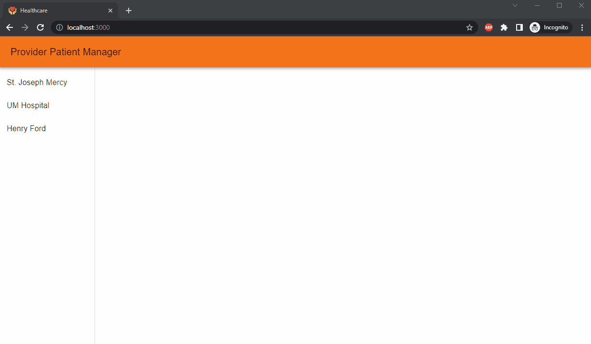
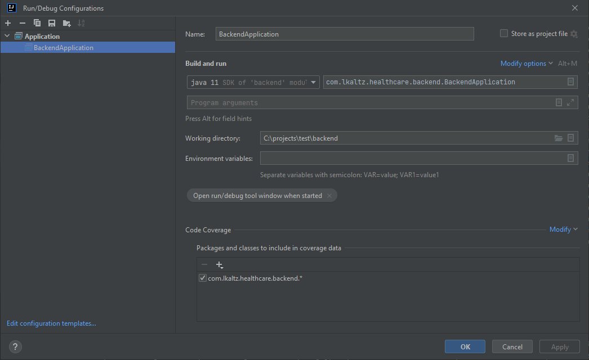
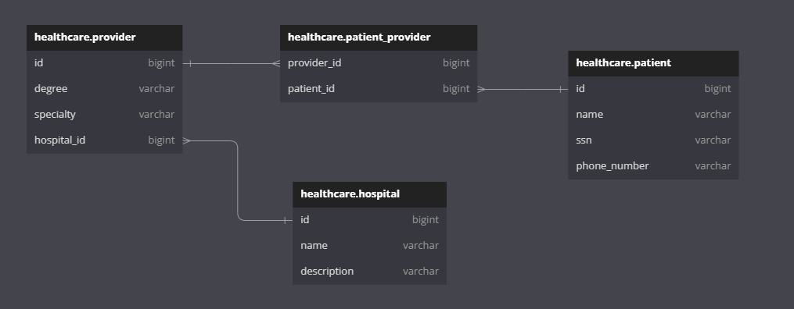

# Demo Healthcare Patient Manager Application

This single page application allows a user to explore providers at a given hospital, view their current patients list, and add patients to a selected provider.

There are two major elements to this application:

- UI: React JS using Node v16.17.1 using Material UI
- Backend: Java spring boot using openJDK 11

## Overview

When the user makes a request to http://localhost:3000 (or the respective host IP) they are met with a single page web application displaying available hospitals on the left.

Clicking on the hospital will display a list of providers.

Selecting a provider will display a management page for the selected provider.

The user can then add a patient to the provider at the selected hospital by clicking the "ADD PATIENT" button.

The new patient is added to the provider's patients.



## Docker-Compose Quick Start

```
docker-compose up --build
```
Please note that the UI dockerfile contains the addition of an environment variable for the backend api url.

## Manually Running

### Backend

Building the backend requires JDK 11 and maven. Explore into the "backend" folder and run:

```
mvn clean install
```

The spring boot backend can be started from "com.lkaltz.healthcare.backend.BackendApplication", here is an example run/debug configuration:



### Frontend

Building the frontend requires Node. Explore into the "ui" folder and run:

```
npm run build
```

Starting the frontend app in development mode:
```
npm run start
```

Please note that building will also run all included tests prior to build completion for both ui and backend.

## Design

### UI Design

The UI is a single page web application built with React and makes use of the [Material UI](https://github.com/mui/material-ui) components library and stylings.
Other 3rd party packages used:
- [notistack](https://github.com/iamhosseindhv/notistack): application notifications
- [react-hook-form](https://github.com/react-hook-form/react-hook-form): form creation
- [yup](https://github.com/jquense/yup) and [@hookform/resolvers](https://www.npmjs.com/package/@hookform/resolvers): form validation

Testing is performed with React testing library and jest. With more time, end-to-end testing could have been accomplished with Cypress.


### Backend Design

Overall there are 3 entities and a join table:

- hospital
- provider
- patient
- patient_provider(join table)

The following relationships exist:

- Hospital/Provider: one to many
- Provider/Patient: many to many



There are 2 main REST api endpoints:
- GET /hospitals/: Returns all hospitals, their associated providers, and their associated patients.
- POST /providers/add-patient/{providerId}: accepts an application/json of a new patient, and a path variable of the provider id to associate the new patient to.

The more patients/provider/hospitals that are added, the more of a need there is to setup smaller transactions.
ex: patients could be loaded with pagination upon the selection of a provider.

Test cases were created to test the controller endpoints using Junit v5 and TestRestTemplate.

#### Assumptions:

- Providers can only belong to a single hospital, though they could be manually added again to another hospital and maintain a seperate patient list for that hospital
- Patient can belong to multiple providers
- Patient SSN is unique and every patient will have one
- Patient phone number is always 10 digits(3 digit area code followed by 7 digits)
- There is no application security

