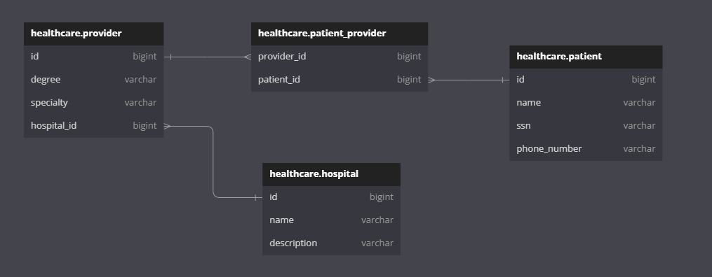

# Demo Healtchare Application

This single page application allows a user to explore proivers at a given hospital, view a providers current patients, and add patients to a selected provider.

There are two major elements to this application:

- UI: React JS using Node v16.17.1 using Material UI
- Backend: Java spring boot using openJDK 11

## Overview

When the user makes a request to http://localhost:3000 they are met with a single page web application displaying availible hospitals on the left.

Clicking on the hospital will display a list of providers.

Selecting a provider will display a managment page for the selected provider.

The user can then add a patient to the provider at the selected hospital by clicking the "ADD PATIENT" button.

The new patient is added to the provider's patients.


## Docker-Compose Quick Start

```
docker-compose -up --build
```

## Manually Running

### Backend Build

Building the backend requires JDK 11 and maven. Explore into the "backend" folder and run:

```
mvn clean install
```

### Frontend Build

Building the frontend requires Node. Explore into the "ui" folder and run:

```
npm run build
```

Please note that building will also run all included tests prior to build completion for both ui and backend.

## Design

### Entity Design

Overall there are 3 entities and a join table:

- hospital
- provider
- patient
- patient_provider(join table)

The following relationships exist:

- Hospital/Provider: one to many
- Provider/Patient: many to many



#### Assumptions:

- Providers can only belong to a single hospital, though they could be manually added again to another hospital and maintain a seperate patient list for that hospital
- Patient can belong to multiple providers
- Patient SSN is unique and every patient will have one
- Patient phone number is always 10 digits(3 digit area code followed by 7 digits)
